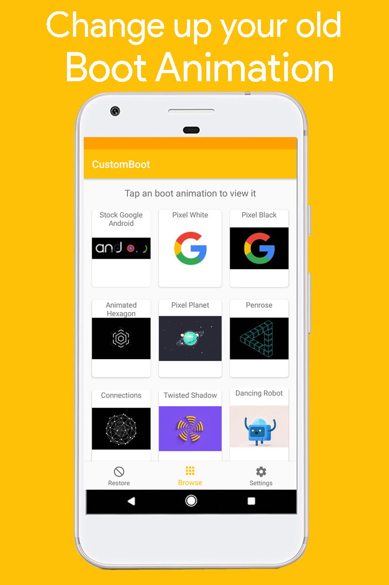
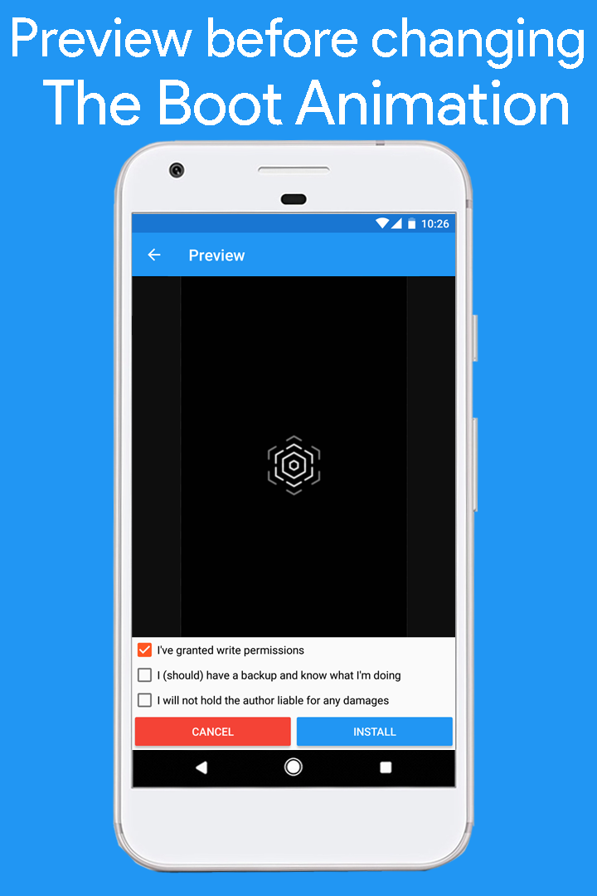
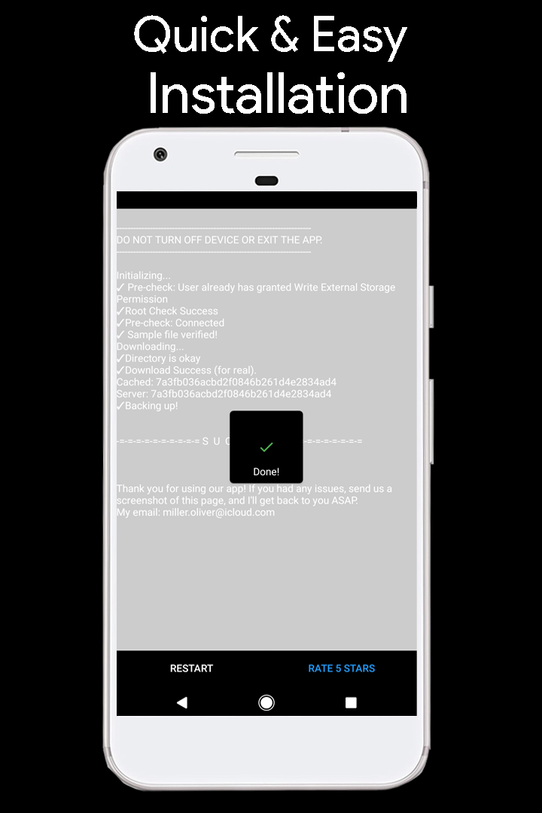

<h1>CustomBoot</h1>
This app allows rooted Android users to swap out their current boot animation from a selection of curated boot animations that will make your device more interesting.
Any help greatly appreciated. 
<b>Play Store Link:</b> https://play.google.com/store/apps/details?id=website.olivermillers.customboot2

 

 

<h1>Open Source &amp; GitHub</h1>
This app was originally closed source, however, I am working on making this app open source.

 

<h1>Current Status</h1>
App is currently undergoing maintenance and is unlisted from the Play Store.
 

  
  
  

 
<h1>Contact Me</h1>
<b>Email:</b> miller[d0t]oliver[at]icloud[dot]com 
<b>Website:</b> https://www.olivermillers.website
